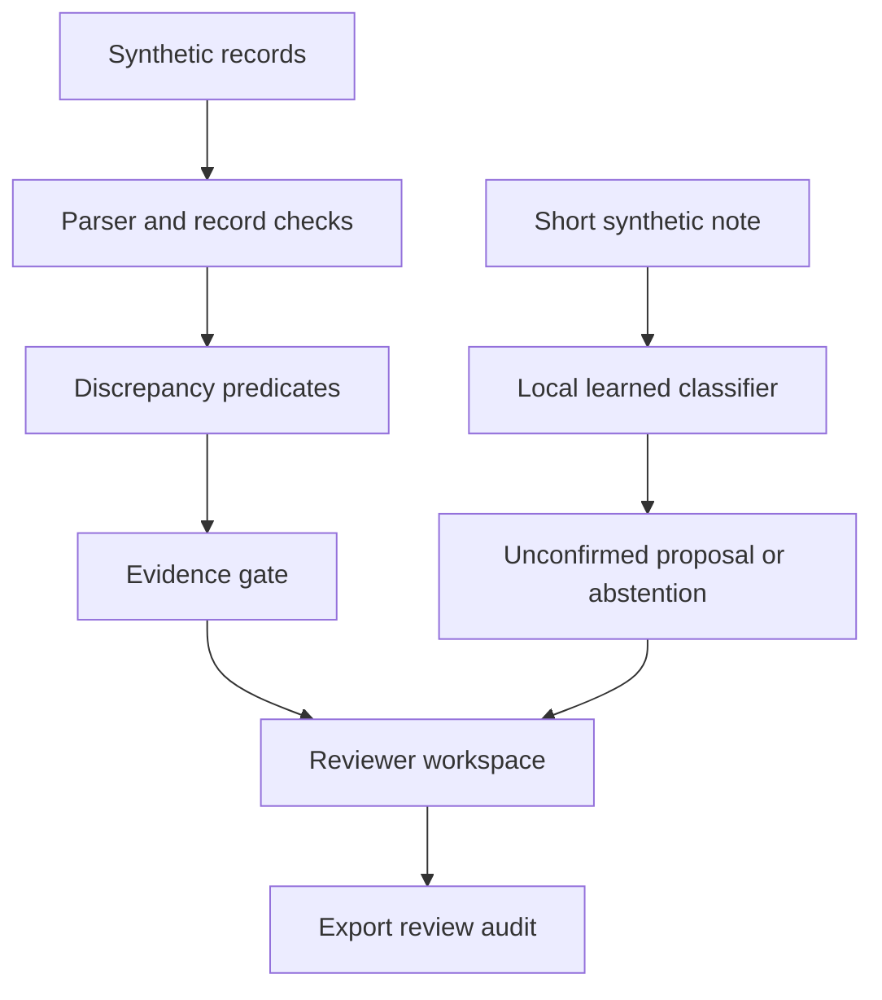

# SentinelRx

**AI-assisted medication-transition review, with visible source evidence.**

> AI reads the note. Rules check the records. The reviewer decides.

Discharge records can contain an apparent omission while a note describes an intended stop. SentinelRx lets a reviewer inspect both without allowing a learned interpretation to erase a record discrepancy. It is an interactive research prototype using synthetic FHIR R4-shaped data, not a clinical product.

## What actually runs

- A **local learned classifier** (character TF-IDF + logistic regression) proposes stop / continue / change / start from a short medication-transition note. It trains reproducibly on 48 published synthetic examples, with no API key or network inference.
- A **separate deterministic record path** flags potential omissions, additions, duplicate records and dose-text differences. Its gate checks evidence references, identity, source roles and bundle-local predicates.
- **EVIDENCE-CHECKED / ABSTAIN** labels describe the record path only. AI outputs remain **PROPOSED / ABSTAIN**. Neither means clinical correctness.
- The reviewer manually links a note to a medication, sees the exact quote, adds a demo annotation and exports a JSON audit with hashes, model version and record findings. There is no treatment execution or automated resolution.
- Counterfactual controls rerun the record analysis after changes to synthetic records.



The model cannot mutate the bundle, suppress a discrepancy, change its evidence status or make a prescribing decision. Note-to-medication linkage is supplied by the reviewer, not verified by the model.

## Run

Python 3.11+:

```bash
python -m venv .venv
# Linux/macOS:
source .venv/bin/activate
# Windows PowerShell: .venv\Scripts\Activate.ps1
python -m pip install -e ".[dev]"
python -m pytest -q
python -m streamlit run sentinelrx/ui.py
```

API: `uvicorn sentinelrx.api:app --reload`. `/analyze` accepts a synthetic collection Bundle; `/note-review` accepts `{"text": "Stop this medication at discharge."}`. Requests are limited to 1 MB; notes to 2,000 characters. There is no authentication, persistence or production deployment claim.

## Evidence, including the limitations

| Suite | Observed result | What it supports |
|---|---|---|
| Pytest | 78 passing tests | Regression, candidate tampering, subject/identity checks, API bounds and AI isolation |
| Learned note classifier | 23/24 exact outputs including abstention; 15/24 receive proposals; 15/15 proposals correct | One small author-written synthetic split, excluded from model fitting |
| Ambiguous/unsupported note subset | 0/8 accepted by the classifier | These eight authored cases only; not proof of general rejection safety |
| Standard generated records | F1 1.000 across 120 repeated-template cases | Agreement with the implemented rule specification |
| Set-presence baseline | F1 0.600 | Limited comparator that cannot detect dose changes or duplicates |
| Generated incomplete/edge records | 90/90 expected finding sets and abstention presence; 0 crashes | Template regression behavior |
| Authored perturbations | 32/32 expected finding sets; 0 crashes | Development cases, not held-out validation |

The note classifier abstains on one of the 16 labelled positive evaluation notes. Its 15/15 accepted accuracy is **not a clinical accuracy estimate**. Model scores are uncalibrated. The train and evaluation files were authored in this development session, share vocabulary and are not independently labelled. Fixed thresholds were not adjusted after this split was scored. Read [AI_MODEL_CARD.md](AI_MODEL_CARD.md) and [note_ai_results.json](note_ai_results.json) for every prediction, hashes and limitations.

Reproduce from the repository root after installing the package:

```bash
python scripts/run_benchmark.py
python scripts/run_robust_benchmark.py
python scripts/run_perturbation_benchmark.py
python scripts/evaluate_note_ai.py
```

## Supported record contract

- Synthetic `Bundle.type=collection`; malformed entries are rejected rather than silently discarded. This is not full FHIR schema validation.
- One explicit Patient; medication subjects must reference it. Conflicting explicit patient references block verification.
- Active MedicationRequest with `intent=order`, or active MedicationStatement, with nonempty resource IDs. Prohibitive orders, modifier extensions and replacement-order links require review.
- Medication identity is a delimiter-escaped **system + code**, not code alone. Two systems sharing a code remain distinct. No terminology mapping or brand/generic inference is performed.
- Exact project tags admission/home/pre and discharge/post define transition sides. Encounter chronology and list completeness are assumed, not validated.
- Unknown identity blocks absence-based omission/addition claims, because the unknown record might be the missing counterpart. It does not globally block a fully supported positive dose/duplicate predicate for another known identity.
- Omission/addition means absence from the supplied opposite list **assuming completeness**. An intended medication change is not necessarily an error.
- Duplicate detection concerns distinct records, not proof of duplicate prescriptions. Dose comparison is normalized text difference, not semantic dose reasoning. Missing dose text is unassessed.
- The gate shares parser output with detection. It is not an independent clinical or FHIR validator.
- JSON retains `verification_status="verified"` for compatibility; the UI calls this **EVIDENCE-CHECKED**. Medication keys and finding IDs changed in v0.5 to include terminology system.

## Prior work and what changed

[FHIRGuard](https://github.com/athena-kanellatou/fhirguard) predates this submission and explores the same medication-reconciliation, provenance and abstention concepts, including constrained model use. We do **not** claim to have invented AI plus verification here. SentinelRx is a separate, compact competition implementation focused on an interactive review workflow.

This revision adds a local learned note classifier, a manually linked note/record comparison workspace, source-hashed review exports, namespace-safe medication keys, stricter patient/order checks, explicit labels and an authored model evaluation split. These are concrete implementation changes, not proof of research novelty or competition eligibility. See git history for build dates.

## Submission materials

- [Devpost text](DEVPOST_SUBMISSION.md)
- [Demo script](DEMO_SCRIPT.md)
- [Judge one-page PDF](assets/SentinelRx_Judge_OnePager.pdf)
- [Code PDF](assets/SentinelRx_Code.pdf)
- [Submission checklist](SUBMISSION_CHECKLIST.md)

No externally reviewed clinical evaluation, real-world effectiveness, full FHIR conformance, safe discharge determination, calibrated clinical confidence or clinical deployment is claimed. A reviewer still needs source confirmation. Existing recorded media must be replaced to demonstrate this revision.
